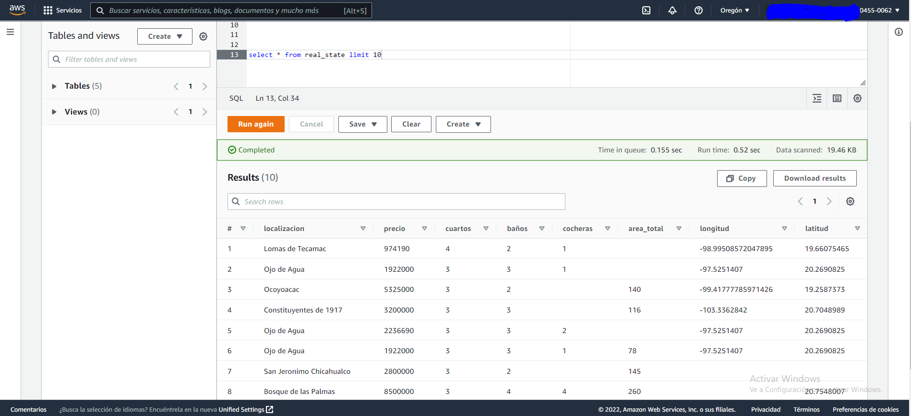

# HOUSE PRICES
### Project overview
* Se hace un proceso de ETL completo usando diferentes tecnologias (Pyspark, beatifulsoup, AWS, sklearn)
* Se extrae informacion de una pagina de ventas de inmuebles, los datos se suben crudos a S3
* Con Glue y pyspark se eliminan duplicados, se da formato a los campos y se almacena en athena sql
* Finalmente se hace EDA y se usa regresion lineal para calcular los valores faltantes del area del inmueble

### Objectives:
Se puede observar un ETL completo desde obtener datos crudos hasta obtener conocimiento de estos datos

### Part 1: Extraction 
- La extraccion se hace de la pagina **[www.vivanuncios.com.mx](https://www.vivanuncios.com.mx/s-venta-inmuebles/estado-de-mexico/v1c1097l1014p1)**
- En esta parte se extrae la informacion usando BeautifulSoup y se usa geopy para calcular las coordenadas
- Se usa Boto3 y pandas para cargar el dataframe obtenido a una bucket de S3
- You can see the full and detailed script **[HERE](https://github.com/Roberto121c/House_prices/blob/main/Code/House_pricing_1.ipynb)**:

### Part 2: Transformation and Load
- Se realiza un glue para pasar los datos de s3 a athena y asi poder analizarlo mejor o almacenarlo{
- La limpieza de los datos se hace con pyspark y consiste en eliminar duplicados y cadenas extras como '+'
- El almacenamiento se hace en formato parquet a s3 desde donde se puede leer en athena sql
- You can see the full and detailed script **[HERE](https://github.com/Roberto121c/House_prices/blob/main/Code/House_pricing_2.py)**:

### Part 3: EDA
Cual es el objetivo de esta parte
Que se hizo
Que herramientas se utilizaron
You can see all the script **[HERE](https://github.com/Roberto121c/Sales_Management/tree/main/Query)**:

### Conclusions
* Que se logro?
* Que herramientas se usaron
* De que sirve

