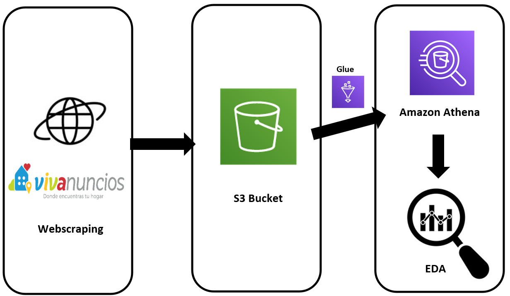

# HOUSE PRICES
### Project overview
* Developed a complete ETL process using different technologies (Pyspark, beatifulsoup, AWS, sklearn)
* Scraped information from a real state webpage, the crude data is stored in S3
* Cleaned the data with AWS Glue and pyspark, then loaded it to Athena SQL
* Finally did EDA and model a linear regression to calculate the missing data about total area

### Objectives:
Develop a complete ETL process from crude data to EDA and a simple regression model

### Part 1: Extraction 
- The page used for webscraping is: **[www.vivanuncios.com.mx](https://www.vivanuncios.com.mx/s-venta-inmuebles/estado-de-mexico/v1c1097l1014p1)**
- The python library used for scraping is BeautifulSoup and geopy was used to calculate coordenates
- Crude data was loaded to the S3 bucket using pandas and boto3
- You can see the full and detailed script **[HERE](https://github.com/Roberto121c/House_prices/blob/main/Code/House_pricing_1.ipynb)**:

### Part 2: Transformation and Load
- With Glue we can move the data from s3 to athena, in this way we can do analysis later with SQL although it is not explored in this project
- Data cleaning was done in the same Glue job using pyspark
- The storage is in parquet format to s3 where athena can read it
- You can see the full and detailed script **[HERE](https://github.com/Roberto121c/House_prices/blob/main/Code/House_pricing_2.py)**:

### Part 3: EDA
- During the EDA I discovered a lot of missing values in the area_total column
- I handled outliers and missing values
- Developed a model using sklearn linear regression, "Precio", "Baños", "Cuartos" and "Cocheras" were the labels
- Calculated the missing values using the model obtained 
- You can see the full and detailed script **[HERE](https://github.com/Roberto121c/House_prices/blob/main/Code/House_pricing_3.ipynb)**:

### Conclusions
* In the future is possible to use the latitude and longitud values to explores prices by zones
* Maybe we could explore different possibilities to obtain a bigger volume of data to get better results
* Linear regression is a powerful yet simple model that can give us great results

